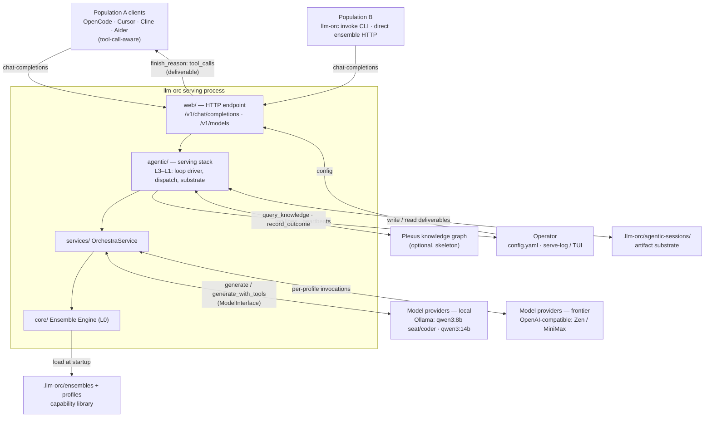
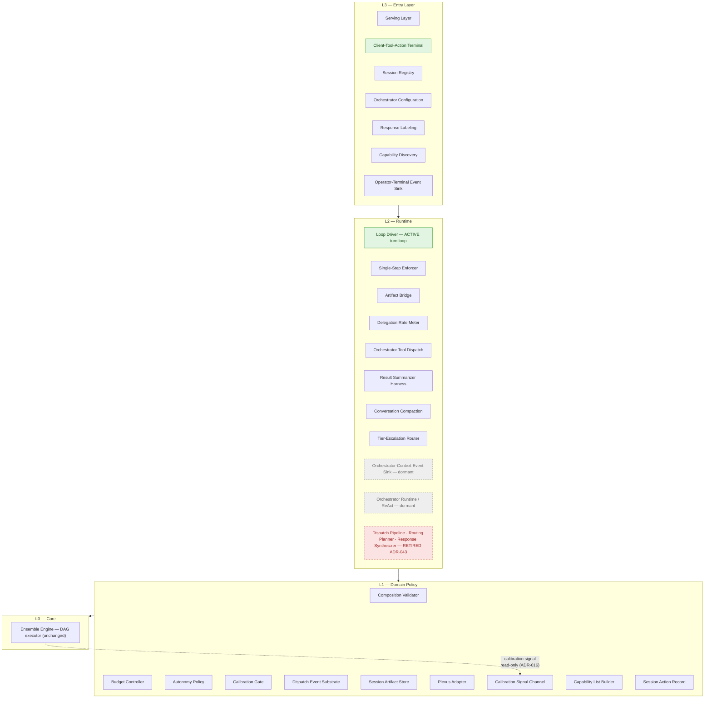
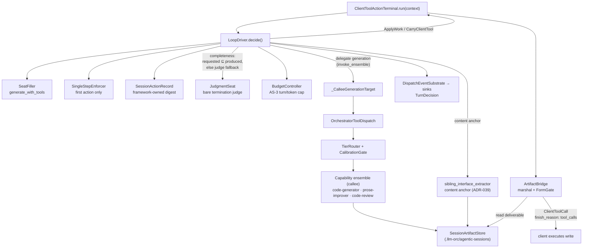
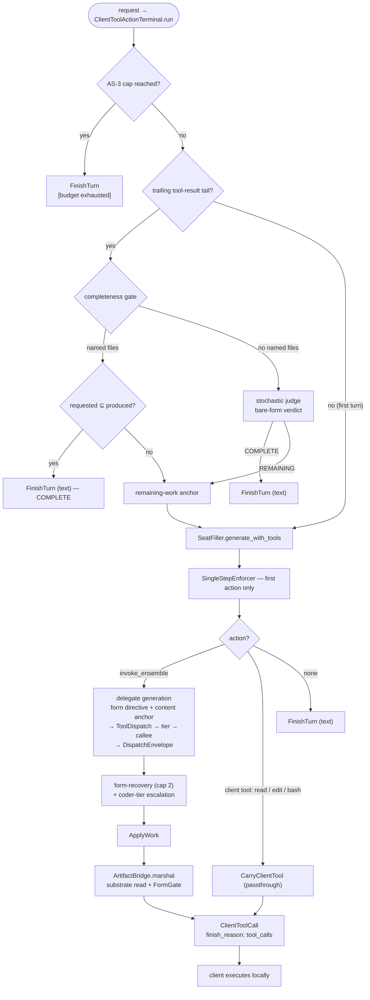

# Agentic Serving — Architecture Map (multi-fidelity)

> **SUPERSEDED, historical record (Cycle-8 declarative collapse, WP-F8 2026-07-08).** The "ACTIVE" turn loop described below (`ClientToolActionTerminal` → `LoopDriver.decide()`, and the DORMANT `OrchestratorRuntime`) has been DELETED: the entire `src/llm_orc/agentic/` layer was removed in the clean-slate collapse (ADR-045/046). The current architecture is ONE declarative Serving Ensemble (classify → seat → marshal), in `system-design.md` §Cycle 8, with the current module-to-code map in `field-guide.md`. This map is retained as an 8-cycle historical orientation; do not read its file:line citations as current.

**Purpose:** a step-back orientation after 8 cycles. Four diagrams at graduated zoom (system → layers → orchestration core → one turn), reconciled against the actual code and the 44-ADR trail, with a drift section and the open questions pinned to components/ADRs.

**Built 2026-06-25** from three grounding reads: the design docs (`system-design.md`, `ORIENTATION.md`, `domain-model.md`), the code (`src/llm_orc/agentic/`), and the ADRs (`decisions/adr-001 … adr-043`).

> **The single most important reconciliation:** the architecture has converged to **one live turn loop**. The code still carries two now-inactive predecessors. Read this before the diagrams:
> - **ACTIVE** (what OpenCode drives, what PLAY exercised): `web/ → ClientToolActionTerminal → LoopDriver.decide()` — the Layer-A loop (ADR-033+).
> - **DORMANT**: `OrchestratorRuntime` — the original ReAct orchestrator-LLM loop (ADR-001/011). No production caller on the chat-completions surface.
> - **RETIRED (ADR-043)**: Dispatch Pipeline / Routing Planner / Response Synthesizer (ADR-027/028/029). `dispatch_pipeline.py` + `ensemble_backed_roles.py` deleted.
>
> The eight-cycle story in one line: you started with a ReAct orchestrator loop *and* a plan→dispatch→synthesize pipeline, and collapsed both into the single `LoopDriver`. The PLAY gaps are gaps in *that* converged loop.

---

## Fidelity 0 — System context (whole llm-orc)

The serving stack in its environment: who calls it, what it sits on, what it talks to.

**Reading guide.** Clients see a transparent OpenAI-compatible endpoint (AS-10: routing decided from request content alone, no opt-in). The deliverable always returns as a client-executed `tool_call`, never a server-side write (the parity commitment). Beneath `agentic/` sits the unchanged `core/` Ensemble Engine (L0). Two model tiers feed it: local Ollama (the cheap seat + coder, the 32GB-rig commitment) and an optional frontier escalation. Plexus is optional everywhere (AS-8).

---

## Fidelity 1 — The four layers (L0–L3)

ADR-002's layering. Edges point downward only, with one narrow read-only exception (ADR-016). Dormant and retired components shown in place so the convergence is visible.

**Reading guide.** L3 owns the wire surface and session identity; L2 owns per-turn agentic control (the Loop Driver and its meters/sinks); L1 owns policy (budget, autonomy, calibration), the artifact substrate, and the framework-owned action digest; L0 is the untouched ensemble engine. The single upward dashed edge is the calibration signal channel (the one sanctioned exception to "no upward edges"). Green = the live path; grey dashed = preserved but uncalled; red dashed = deleted by the ADR-043 collapse. The existing `system-design.md` ASCII diagram still shows the retired pipeline as if live — this diagram supersedes it (see Drift).

---

## Fidelity 2 — Orchestration core (the active turn loop)

The Loop Driver and its collaborators — the machinery every PLAY observation touched. Constructor wiring from `loop_driver.py:498-536`.

**Reading guide.** The Loop Driver decides *one* action per request. Generation is delegated to a *single* capability ensemble (the callee) — there is no planner or synthesizer stage (FC-44). The seat-filler chooses the capability by name via `invoke_ensemble` (orchestrator-reasoned, `loop_driver.py:905`); the framework hardcodes the destination to `write` (`:684`). Termination is owned by the framework's own action digest (`SessionActionRecord`), not the client's serialized messages: deterministic `requested ⊆ produced` for named-file tasks (ADR-040), stochastic `JudgmentSeat` otherwise (ADR-037). The content anchor (ADR-039) feeds prior siblings' API surfaces into the callee so cross-file references resolve.

---

## Fidelity 3 — One turn, end to end

The control flow of a single `LoopDriver.decide()` — entry to client-executed deliverable. This is the dynamic view; the gap callouts after it pin where PLAY's findings live.

**Where the PLAY gaps sit on this flow (Cycle 7 deferred-surface run):**

- **`completeness gate` → `named files` branch (ADR-040).** Requested filenames are a regex over the *task prose*. The composition named only `account.py`, so `requested=1`; the loop finished COMPLETE after one file while three self-planned items remained. *This is a documented limitation (ADR-040 §Limitations), hit live.*
- **`invoke_ensemble` → destination hardcoded `write` (`:684`, LB-3 deferred).** `edit`/`bash` can't be delegation destinations, so edit-and-run work bypasses the cheap tier entirely (the composition ran at `delegation rate=0.000`).
- **`delegate generation` is single-callee (FC-44).** No decompose → fan-out → synthesize. The callee's form template can override task intent (audit returned as a "code-review summary").
- **No path for the agent's plan.** `todowrite` is carried but never reaches this loop; termination is the gate or the judge, never the plan. `task`/`skill` are never emitted by the seat at all.

---

## Intended vs actual: drift

Where the documented architecture and the code disagree (a step-back's main job):

| Drift | Detail | Fix |
|---|---|---|
| **Stale top-level diagram** | The `system-design.md` architecture-at-a-glance ASCII diagram pre-dates Amendment #20 (ADR-043) and still shows the Dispatch Pipeline as if active. | This map's Fidelity 1 supersedes it; update or cross-link `system-design.md`. |
| **Stale field guide** | `field-guide.md` is self-marked stale (2026-06-03): no entries for Dispatch Event Substrate, Session Artifact Store, Loop Driver, Single-Step Enforcer, Artifact Bridge, Client-Tool-Action Terminal. | Regenerate the field guide from the current module set, or retire it in favor of this map. |
| **Dormant-but-present code** | `orchestrator_runtime.py` (ReAct) and the context-event sink have no production caller on the chat-completions surface, but remain in the tree as "architecture of record." | Intentional (ADR-033 disposition a). Worth a one-line header banner in those modules so future readers don't assume they're live. |
| **Diagram layer placement** | The source ASCII diagram renders `Session Action Record` under L2; the module tables place it in L1. | Module table is authoritative (L1). |

---

## Open questions (pinned)

Synthesized from the ADR "open threads" plus the Cycle 7 PLAY findings. Grouped so the roadmap can sequence them. Each is pinned to its ADR/component.

### A. The central unvalidated hypothesis
- **Axis-2 long-horizon coherence** (ADR-033, Conditional Acceptance). Does a cheap seat-filler sustain a coherent trajectory over *many* turns? Axis-1 (per-turn grounding under single-step enforcement) is validated; axis-2 is the named PLAY target. PLAY's composition (1 of 4) is a data point, but confounded by the ADR-040 gate terminating early — so axis-2 is **still genuinely open**, not refuted.

### B. The orchestration gaps PLAY surfaced
- **Plan-driven control** (new, no ADR). The agent's plan (`todowrite`) has no path into the loop; termination is regex/judge, never the plan. The deepest gap — most others are downstream of it.
- **Composition vs single-callee** (FC-44, and the *retired* ADR-027/028/029). Task-level decompose→integrate is gone. Open: does north-star need it back, in a different form than the retired pipeline?
- **Delegation surface narrowness** (ADR-035 LB-3). Destination hardcoded `write`; `edit`/`bash` can't delegate. Greenfield-only offload.
- **`task` / `skill` non-emission** (new). The seat reproduces only `todowrite` of the three deferred client tools, and acts on none.

### C. Known-tracked limitations (the ADRs already flag these)
- **ADR-040 regex coupling.** Requested-filename regex over prose can corrupt/stall termination. Durable fix named: *structured deliverable declaration* in place of regex-over-prose. (This is exactly what bit the composition.)
- **Seat-filler transferability** (ADR-036 Arm D). The delegation lever doesn't transfer across models (qwen3.5:9b 1/5; mistral-nemo 2/5); failure boundary uncharacterized.
- **Discharge gates still open**: ADR-039 content anchor (real-OpenCode multi-file trajectory), ADR-041 convergence (organic escalate-and-converge), ADR-035 axis-2 form compliance over a north-star-length flow.

### D. Designed but not built
- ADR-012 conversation compaction · ADR-013 session registry · ADR-014 calibration trajectory extension · ADR-017 phantom-tool-call guard. All **Proposed, not Accepted**.

### E. Dormant-pipeline residue
- ADR-031/032 (latency policy, configuration-honesty / transparent-endpoint split) lost their caller in the ADR-043 collapse. The concerns persist on the unified loop but are **uncharacterized**. ADR-009 Plexus phase-2 context injection deferred.

---

*Diagrams are Mermaid (render in IDE / GitHub). To export PNG/SVG for offline study, say the word.*
