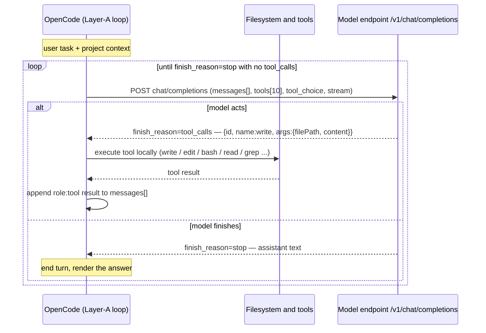
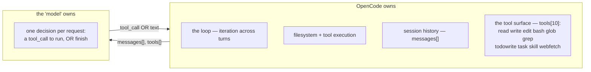
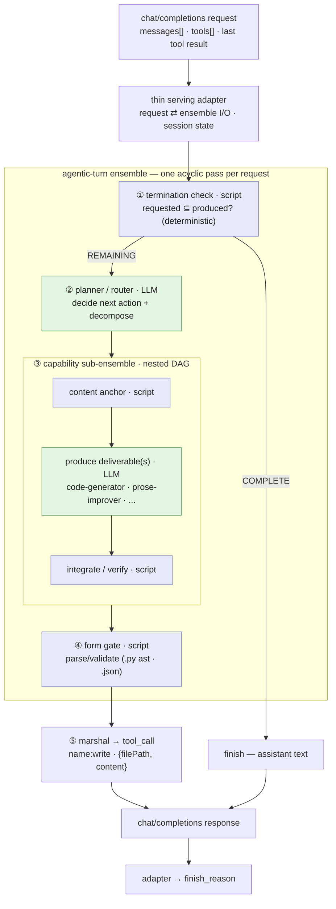
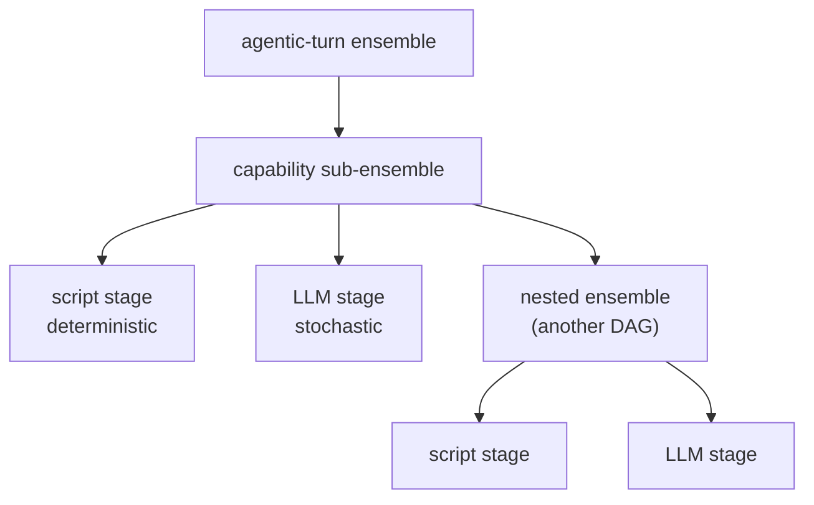

# Design exploration: the agent as ensemble composition

**Status:** design exploration, not as-built. Pairs with `../architecture-map.md` (which is the current as-built). This sketches a *could-be*: expressing the per-turn agentic behavior as an llm-orc ensemble instead of the bespoke `LoopDriver`. It is the paper substrate for the spike that would validate or refute the idea.

**Thesis.** OpenCode owns the loop. Each request to the "model" asks for exactly one thing: the next step (a tool call) or a finish. So a single request is one *acyclic* pass, which is precisely what an ensemble DAG expresses. The orchestration we currently hand-code in Python (decide → delegate → gate → marshal) can instead be *composed* from the engine we already ship: LLM stages for planning and generation, script stages for the deterministic gates, ensembles nested inside ensembles for richer per-step work.

---

## Section 1 — How OpenCode drives a model (the contract)

OpenCode is an agentic client that talks to an OpenAI-compatible chat-completions endpoint. It, not the model, owns the loop, the filesystem, the tool execution, and the conversation history. The model's job is narrow.

### 1a. The turn loop

### 1b. Who owns what

**The contract llm-orc must meet.** Given `messages[]` (system + history + the last tool result) and `tools[]`, return either (a) a `finish_reason: tool_calls` response carrying one client tool call, or (b) a `finish_reason: stop` text answer. That is the entire surface. The deliverable (a file's bytes) rides *inside* a `write` tool call, never a server-side write (the parity commitment). OpenCode re-prompts with the tool result, and the loop continues. **The model never needs cycles, state, or a filesystem of its own. It needs to be good at one decision.**

---

## Section 2 — Composing the agent as llm-orc ensembles

Because the model's per-request job is a single acyclic decide-and-produce, it can be an ensemble: a DAG of deterministic (script) and non-deterministic (LLM) stages, with capability ensembles nested inside. The thin serving adapter translates the request into the ensemble's input and the ensemble's output back into a chat-completions response.

### 2a. The agentic turn, as one ensemble

Blue = deterministic script stage; green = stochastic LLM stage. Read the DAG top to bottom: a request enters, the deterministic gate decides finish-or-continue, the planner picks the next action and decomposes it, the capability sub-ensemble produces the deliverable (and could fan out to several capabilities), the form gate validates it, and the adapter marshals the result into a `tool_call` or a `finish`. **The DAG *is* the control flow; there is no separate loop driver.**

### 2b. The capability stage is itself an ensemble (DAGs within DAGs)

This is the part of the engine the current design leaves on the table: the deliverable-producing stage can be an ensemble of ensembles, mixing deterministic and non-deterministic processes.

### 2c. What replaces what

Each bespoke L2 component maps to an ensemble stage. The reliability machinery does not disappear; it becomes *composition*.

| Current (bespoke Python, L2) | Becomes (ensemble) | Kind | ADR |
|---|---|---|---|
| completeness gate | termination-check stage | script (deterministic) | ADR-040 |
| seat-filler next-action decision | planner / router stage | LLM | ADR-033 / 036 |
| single callee (FC-44) | capability sub-ensemble + fan-out | nested ensemble | — |
| content anchor | anchor stage | script | ADR-039 |
| ArtifactBridge / FormGate | form-gate + marshal stage | script | ADR-035 / 041 |
| `LoopDriver` control flow | the DAG is the control | (removed) | ADR-033 |
| client interleaving | thin serving adapter (stays bespoke) | adapter | ADR-034 |

The planner stage and the synthesizer/integrate stages are exactly the *retired* `routing-planner` (ADR-028) and `response-synthesizer` (ADR-029) ensembles, returning in their right role. Spike δ already showed framework-driven chaining of ensembles produces correct, non-confabulated composition where LLM-loop-driving did not. This design generalizes that finding from a 2-stage chain to the agentic-turn shape.

---

## Boundaries (so this is a real proposal, not a wish)

- **The loop stays OpenCode's; the interleaving stays bespoke.** The ensemble engine runs a DAG to completion in one shot. It cannot pause mid-DAG to wait for OpenCode to execute a tool and return. So "emit a tool call, wait, resume with the result" remains the serving adapter's job, between turns. The ensemble owns within-turn intelligence; the adapter owns between-turn glue and session state.
- **Single-pass per request.** Each invocation is acyclic. That is a fit, not a limit, because OpenCode supplies the iteration. But it means a single ensemble cannot itself "keep trying until done" within one request.
- **Latency is the real tax.** Composition means more stages means more model calls. PLAY already clocked local composition at ~18 minutes for five files. Script stages are cheap; stochastic stages compound. On the 32GB rig this is a ceiling to design against, not a footnote.
- **Dynamic structure needs runtime composition.** A static YAML DAG fixes the shape. If the decomposition depends on the task, the planner stage must compose an ensemble at runtime (AS-6, compose-from-primitives), which is a sharper, more dynamic capability than a fixed DAG.

## Why it fits the contract

Every request still returns exactly a `tool_call` or a `finish`. OpenCode cannot tell whether a bespoke `LoopDriver` or a composed ensemble produced it. The transparent-endpoint promise (AS-10) holds unchanged. What changes is *behind* the endpoint: the orchestration is the product's own composition engine instead of Python written beside it.

## The next move: a spike, not more design

Build the Section 2a ensemble for one concrete behavior (the composition task: decompose → produce each deliverable → verify), run it through the ensemble engine directly (bypassing the serving loop), and check whether it composes the behavior end to end. Pass condition: the multi-deliverable task completes coherently in one composed pass, with the deterministic gates as script stages doing the work the `LoopDriver` currently hand-codes. The outcome tells us which boundary above is real (latency, dynamic structure) and which is imaginary.
