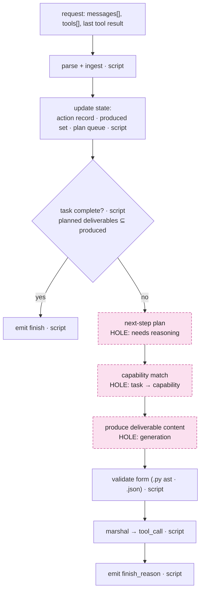
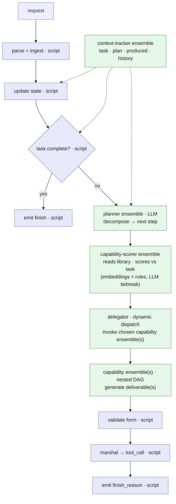
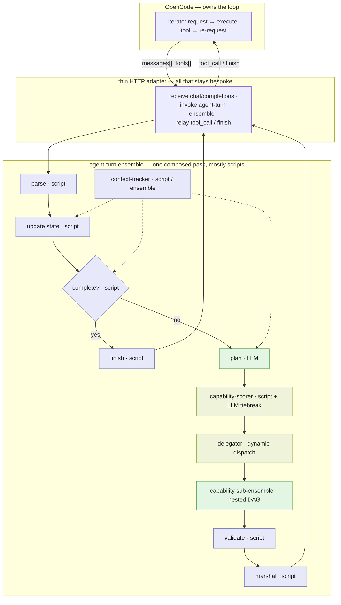

# Design exploration: deterministic-first, ensembles at the holes

**Status:** speculative design exploration. Pairs with `agent-as-ensemble-composition.md` (the contract + the reframe) and `../architecture-map.md` (the as-built). This one applies a specific method and flags the llm-orc engine open questions it depends on.

**Method.** Four steps, in order:
1. Given the OpenCode interface constraint, write the **fully deterministic flow** through one turn.
2. **Find the nodes** in that flow a script provably cannot fill (the holes).
3. **Replace** each hole with an ensemble.
4. **Stretch**: for each ensemble node, ask how far composition + determinism can go, and where the bound is genuinely frontier-model capability.

**Why deterministic-first.** It is not just pedagogy. The non-deterministic surface is where cost and unreliability live. Shrinking it to only the nodes that provably need a model, and letting deterministic stages verify around them, is the reliability-and-cost strategy. It is also what spike δ already showed: deterministic, framework-driven composition beat LLM-loop-driving for correctness.

---

## 1. The constraint (recap)

Per request, given `messages[]` + `tools[]` + the last tool result, return one `tool_call` or a `finish`. OpenCode owns the loop, the filesystem, the history, and tool execution. Full detail in `agent-as-ensemble-composition.md` §1. The agent's whole job is: **decide and produce the next step.**

---

## 2. The deterministic flow (the skeleton)

A fully scripted turn handler, no model anywhere. It gets surprisingly far.

Everything blue-collar is a script: parsing, state bookkeeping, the named-file termination check (`requested ⊆ produced`, ADR-040 already does this deterministically), form validation (ADR-041 ast/json parse), marshalling into a tool call. **Only three nodes are holes** a script cannot fill on its own:

- **Plan** the next step (what to do given the task and state).
- **Match** the work to a capability (which generator handles this).
- **Produce** the deliverable content (write the actual code/prose).

That is the whole irreducible non-deterministic surface of a turn. Three nodes.

---

## 3. The nodes that want an ensemble

| Hole | Why a script can't fill it | Ensemble that fills it | Can it be pushed back toward determinism? |
|---|---|---|---|
| **Plan** | Requires reasoning over an open task | Planner ensemble (LLM) | Partly: templated/known task shapes can be table-driven; novel tasks need reasoning |
| **Match** | Task→capability is a semantic judgment | Capability-scorer ensemble (reads the library, scores descriptions vs task) | **Yes, strongly**: deterministic embedding similarity + rules can do most of it, with an LLM tiebreak only at the margin |
| **Produce** | Generation of novel content | Capability ensemble(s), possibly nested/fan-out | No: this is irreducibly stochastic, but it can be *decomposed* into smaller, cheaper, verifiable sub-generations |

The **Match** row is the interesting dial. It is the reflective node (the ensemble that reads other ensembles as data and scores them), and it is the one most amenable to determinism. A scorer that's mostly embeddings + rules, with an LLM only for ties, is far more reliable and cheaper than letting a model free-pick from the library.

---

## 4. The flow with ensembles slotted in

The skeleton unchanged; the three holes filled. Blue = deterministic script; green = ensemble. The context-tracker threads state into the deterministic nodes (dashed).

This is the reflective-interpreter model derived from the skeleton rather than asserted: `match` is reflection (read the instruction set), `dispatch` is eval/apply (dynamic dispatch to a runtime-chosen target), `ctx` is the store, scripts are deterministic ops, the capability ensembles are the oracle ops. The deterministic frame holds the non-determinism in three contained nodes and verifies on both sides of it.

---

## 5. Stretch: where composition meets frontier-capability

For each ensemble node, how far can it go, and where is the bound the underlying model rather than the composition?

| Node / capability | What composition + determinism buys | vs. a single frontier model |
|---|---|---|
| **Grounding** (content anchor: real sibling APIs injected, ADR-039) | gives the generator ground truth a fresh context lacks | **BEATS** — a frontier model in a clean context invents cross-file APIs; the anchor doesn't |
| **Verification** (completeness, form gate, run-the-tests) | deterministic checks catch what self-assessment misses | **BEATS** — model self-grading is unreliable; a parser/test is not |
| **Capability routing at scale** (the `match` node over a large library) | reflection + scoring ranks hundreds of capabilities reliably and cheaply | **BEATS** — a model can't reliably pick from hundreds of options in-context; scoring can |
| **Decomposable generation** (fan-out sub-tasks → integrate) | turns one hard generation into several cheap, checkable ones | **MATCHES** — and shifts cost from frontier to cheap-tier |
| **Long-horizon coherence** (context-tracker enforces the plan across turns) | deterministic plan-enforcement instead of a model holding it all in-context | **MAY BEAT — the central open bet.** The MOP result says frontier models melt down on long horizons; externalizing the plan deterministically could sustain longer than any single context. Unproven (this is axis-2). |
| **Irreducible reasoning** (novel architecture, deep cross-codebase debugging) | composition can scaffold, decompose, and ground | **BOUNDED by the model** — when the sub-task itself needs deep reasoning, the cheap tier's ceiling is real; here composition scaffolds but cannot substitute, and the frontier escalation rung (ADR-041 §5) is the honest fallback |

The shape of the bet: composition + determinism **beats** frontier on grounding, verification, and routing; **matches** it on decomposable work while moving cost down-tier; **may beat** it on long-horizon coherence (the unproven prize); and is **bounded** by raw model capability only on the irreducibly-hard sub-tasks. The design goal is to push as much work as possible into the first three rows and shrink the last row to where escalation is genuinely warranted.

---

## 6. Engine primitives — verified against the L0 code (2026-06-28)

The §6 questions were investigated in `core/execution/`, `agents/script_agent.py`, and `core/config/` (the two make-or-break verdicts read firsthand). The engine is a **static, declarative dataflow DAG**: fixed topology, every node runs, data flows along edges. Its only source of runtime dynamism is LLM agents; it has **no deterministic control plane.**

| Primitive the design needs | Verdict | Evidence |
|---|---|---|
| **Deterministic dynamic dispatch** (a script picks the target ensemble at runtime) | **NOT PRESENT** | `ensemble_runner.py:66` resolves the child from `agent_config.ensemble`, a static YAML string; the child gets dynamic *input* but never a dynamically-chosen *target*. Dynamic dispatch exists only for the orchestrator LLM via `invoke_ensemble`. |
| **Conditional branching** (skip a node / branch on a value) | **NOT PRESENT** | `ensemble_execution.py:729` runs every phase unconditionally; the dependency gate `dependency_analyzer.py:80` checks only that an upstream agent *ran* (`dep in processed_agents`), never what it produced. No condition/guard/skip field exists. Fan-out is replication, not branching. |
| **Library-as-data to a stage** (a script reads other ensembles' descriptions) | **NOT PRESENT** | `EnsembleLoader.list_ensembles()` returns Python objects unreachable from a script subprocess (env + stdin only); `list_ensembles` is an LLM tool, not a stage-level API. |
| **State threading** | **PARTIAL** | Within one run, yes: a context-tracker stage reads all upstream outputs via `depends_on` from the shared `results_dict` (`dependency_resolver.py`). Cross-run / parent↔child, no: a child ensemble returns one JSON blob; there is no parent→child state injection or cross-invocation store beyond Plexus `record_outcome`. |

**Depth/latency** remains the one genuinely open measurement (depth bounded by Invariant 8; the only latency datum is PLAY's 18-minutes-for-5-files). It is a spike question, not a primitive question.

---

## 7. The honest bound, and the strategic fork (resume here, fresh session)

**Why the as-built architecture is the way it is.** This verification answers the opening question of the whole thread (`we built a large architecture framing the capability without using it`). The reason orchestration lives in a bespoke Python `LoopDriver` rather than in ensembles is **not** an oversight. The engine structurally cannot express agentic control, conditional termination, dynamic dispatch, reflection, runtime state, so all of it *had* to be Python above the engine. The architecture-as-built is a direct consequence of the engine being a dataflow DAG, not a runtime.

**The sharp nuance.** This design *is* buildable today if you let LLM stages do the dynamic work (dispatch via `invoke_ensemble`, library-read via `list_ensembles`, branching via guard-flags + no-op stages). But that is essentially the orchestrator-LLM pipeline already built and retired (ADR-027 / ADR-043) for being unreliable and slow. The entire *value* of the deterministic-first framing was to shrink the stochastic surface, and that deterministic version is exactly what the engine cannot do without new primitives.

**The fork to decide next session:**

- **(A) Keep orchestration as bespoke Python above a static-DAG engine** (today's shape). The engine stays a clean declarative dataflow DAG; the agent stays framework code; the group-B gaps (plan-driven control, multi-callee composition) get solved as more Python in the loop driver.
- **(B) Generalize the core engine into a deterministic programmable runtime** — add the four primitives above (script-initiated dispatch, conditional edges, library-reflection-to-stages, cross-run state). Then the agent can *be* an ensemble (§8), L2/L3 largely collapse, and the agent becomes data that dogfoods the core. Cost: this changes the core engine's character from declarative dataflow toward an interpreter, which affects every non-agentic ensemble user too, and it is real L0 engine work, not a bolt-on.

**What a fresh session should weigh:** whether the payoff of (B) — unification, agent-as-configuration, dogfooding, and a clean answer to the long-horizon bet — justifies generalizing the core engine, versus (A)'s smaller, contained, already-working path. If (B), the next artifact is a scoped design for the four primitives (what each costs in the engine) plus the spike that builds the §4 flow for one real task and measures the §5 stretch rows. If (A), the roadmap returns to the architecture-map's A–E groups as bespoke work.

---

## 8. The collapse: the majority as one ensemble of scripts

Take §4 and dissolve the boundary. The blue script nodes were not "adapter Python," they are **script stages of the ensemble**. Then the whole turn is a single ensemble: mostly scripts, a few LLM oracle stages, the capability sub-ensemble nested inside, and a context-tracker. The only bespoke code left is a thin HTTP adapter and the between-turn interleaving OpenCode drives.

The box is mostly blue. That is the whole point: an agent turn is, in the majority, deterministic computation, expressed as scripts inside one ensemble, with a small stochastic core.

**What this collapses.**
- **The agent becomes data, not code.** The turn logic is ensemble YAML (script references, model profiles, sub-ensemble references). Changing agent behavior is editing an ensemble, not patching the framework.
- **llm-orc becomes the runtime; the agent becomes a program in it.** The L3 serving layer and most of L2/L1 dissolve into composition. The bespoke `LoopDriver`, the delegation machinery, the termination gates, the anchors, the form gates all become stages.
- **The stochastic surface is contained and observable.** Two-and-a-half oracle stages, each emitting dispatch events (ADR-023). A turn is an ensemble execution trace, arguably more inspectable than bespoke Python.

**What genuinely stays bespoke.** The HTTP socket, the request-to-ensemble-input translation, and the between-turn interleaving (emit a `tool_call`, wait for OpenCode to execute it and re-request). The engine runs a DAG to completion; it does not pause mid-DAG for a client tool. So the interleaving and session continuity live in the thin adapter. That is the irreducible serving glue, and it is small.

**The new crux this surfaces (on top of §6): conditional control flow.** A pure fan-out DAG runs every stage. An agent turn needs a branch: if complete, finish and skip generation; else produce. Two ways this resolves, and which one applies is an engine question to verify:
- If the engine supports **data-dependent branching / conditional edges**, the `complete?` node is a real branch (clean).
- If it is **pure fan-out only**, the branch is emulated with guard-flags: the termination script sets a flag, downstream stages no-op when set. Expressible, at the cost of running cheap no-op scripts. Workable, less elegant.

Either way the behavior is expressible; the question is how cleanly, and it joins §6 as a thing to confirm in the L0 code before committing to this shape.

**The payoff.** The agent is configuration: versioned, diffable, swappable per task-cluster (a different agent ensemble for BUILD vs DISCOVER), introspectable, and composable into other ensembles. And it is the ultimate dogfooding: the agent is built from the product's own primitive, so every improvement to the ensemble engine is an improvement to the agent, and vice versa. This is the architecture that leverages the capability instead of merely framing it.
