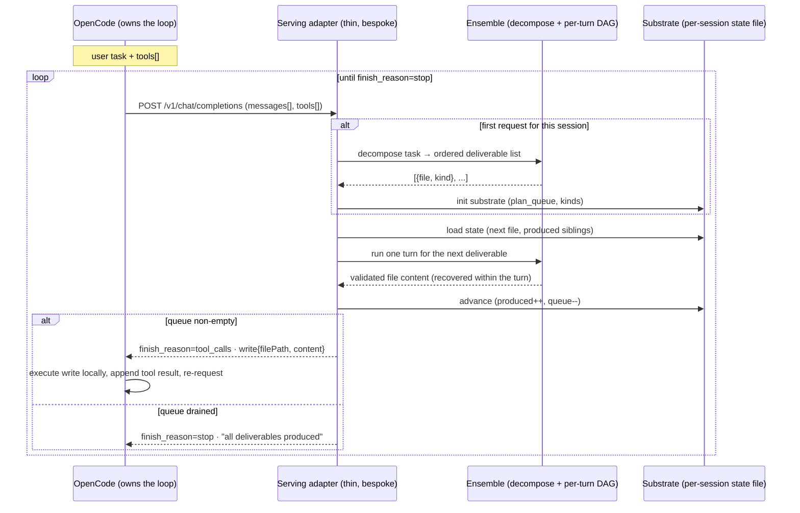
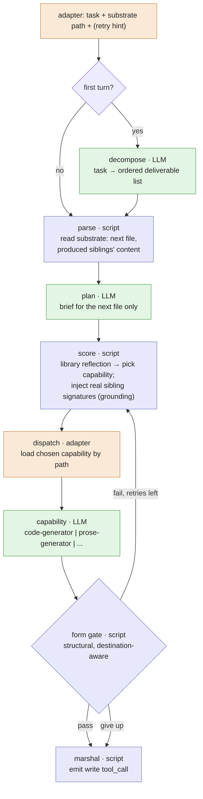
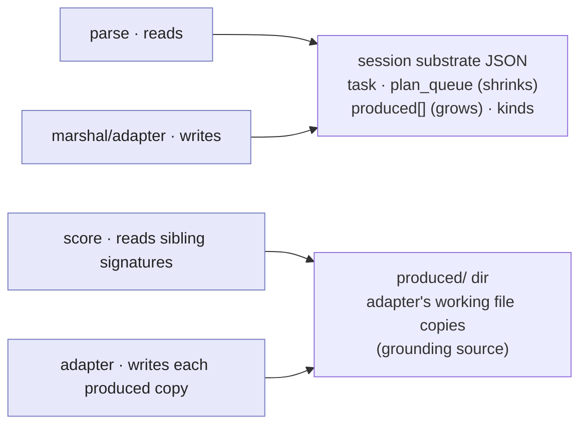
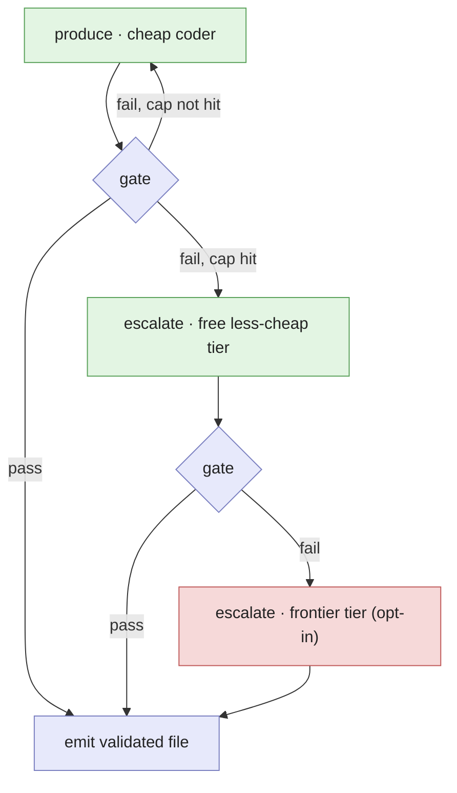
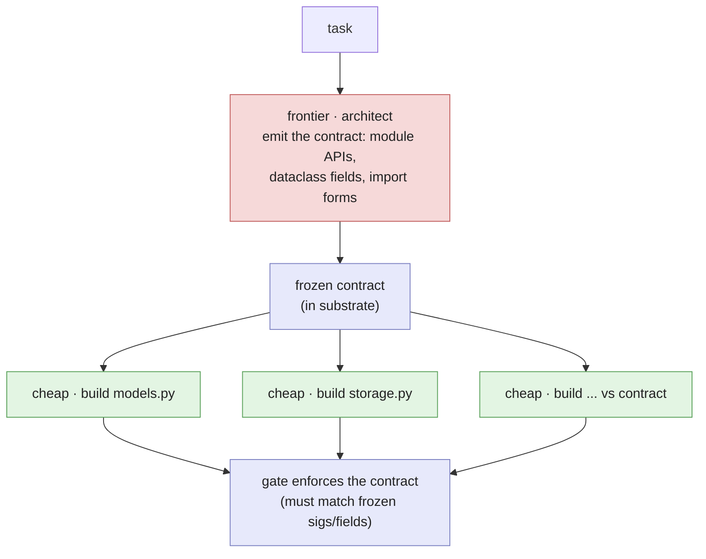

# The ensemble agent: settled serving architecture + composition strategies

**Status:** as-built and verified 2026-06-29. This is the settled successor to
`agent-as-ensemble-composition.md` (the speculative proposal) and the
deterministic-first companion. It records what the Ω spike sequence actually
proved, diagrams the working architecture, and lays out the composition
strategies available over it. Pairs with `ensemble-spike-sequence.md` (the
gated spikes + findings) and the per-spike READMEs under
`scratch/spike-omega-*/`.

**The one-line state of play.** The ensemble-only architecture serves OpenCode
transparently and drives a multi-file task to completion as if it were a single
model (question (a): **yes**, verified). The open problem is composing
ensembles so the cheap-tier output reaches frontier quality while spending as
few frontier tokens as possible (question (b): the strategies in §4).

---

## 1. What's settled (verified claims, with evidence)

- **The agent can BE an ensemble with no L0 engine change.** Three of the four
  "missing" engine primitives collapse to scripts + the artifact substrate;
  the fourth (dynamic dispatch) is adapter-mediated in ~15 lines. (Ω-1, Ω-2,
  Ω-dispatch.)
- **Cross-run state is a substrate file**, read/written by parse/marshal
  scripts. No engine state machine. (Ω-2.)
- **Recovery is adapter-side retry** against a deterministic gate. (Ω-2b.)
- **Dynamic dispatch is adapter-mediated**: a script reads the ensemble
  library, scores capabilities, and the adapter loads the chosen one by path.
  (Ω-dispatch.)
- **The whole thing serves OpenCode transparently, multi-turn.** A faithful
  OpenCode-contract client drove the ensemble through decompose → 6 files →
  finish in 7 turns; the client never knew an ensemble was behind the endpoint.
  (Ω-serve; real `opencode run` confirmation pending as a2.)
- **Open, not settled: cheap-composition quality.** The all-local ensemble
  ships structurally-valid but sometimes runtime-broken packages (a test wrote
  `import models.Task`; an earlier run drifted a dataclass field). The frontier
  does not, because it holds the whole contract in one context. This is the §4
  / §5 problem, not an architecture flaw.
- **A composition strategy that closes it (verified, Ω-E).** Contract-first
  (§4b) produced a 6/6 *running* package on the same task, every file
  first-attempt, for the cost of one small frontier architect call (all builds
  cheap-local). So frontier-quality cheap composition is reachable at minimal
  frontier cost; the remaining work is generalizing it and exploring the
  tier-routing dial (§4, §6).

---

## 2. The serving architecture

### 2a. The transparent contract (who owns what)

OpenCode owns the loop, the filesystem, and the conversation. The "model" it
talks to is a thin serving adapter in front of an ensemble. Per request the
adapter runs exactly one ensemble turn and returns one client tool call or a
finish. OpenCode cannot tell an ensemble from a single model. This is the AS-10
transparent-endpoint promise, now demonstrated for the ensemble form.



**The irreducible glue (small, bespoke):** the HTTP socket, request↔ensemble-IO
translation, the per-session substrate, the decompose-once gate, the optimistic
advance, and the within-request recovery loop. Everything else is composition.

### 2b. One turn, as an ensemble + adapter

The decide ensemble is three stages (`parse` script → `plan` LLM → `score`
script); the capability invocation, the form gate, the recovery loop, and the
marshal live in the adapter because the engine cannot resolve a runtime-chosen
target or branch on a value. Blue = deterministic script; green = stochastic
LLM; orange = adapter glue.



### 2c. State across turns

The ensemble is stateless per turn; the session lives in the substrate file.
The adapter threads it; the engine never sees it.



---

## 3. The surface to minimize (deterministic vs stochastic)

The whole strategy is to shrink the green rows and make the blue rows verify
around them. What is stochastic today, and how reducible:

| Node | Kind | Reducible toward determinism? |
|---|---|---|
| decompose | LLM | Partly: templated task shapes can be table-driven; novel tasks need reasoning. |
| plan (per-file brief) | LLM | Mostly: structure it out — the next file is chosen deterministically from the queue; the LLM only elaborates the brief. |
| capability pick (score) | **script** | Already deterministic (library reflection + keyword/embedding rules + LLM tiebreak only at the margin). |
| produce (capability) | LLM | No: irreducibly stochastic generation, but decomposable into smaller checkable pieces. |
| gate / parse / marshal / grounding | **script** | Deterministic. The quality lever lives here (how strong the gate is). |

The frontier-token bill is paid only by the green rows, and only when a
strategy in §4 routes them to a frontier tier.

---

## 4. Composition strategies (different ensemble approaches)

Five distinct ways to compose this architecture, on a spectrum from zero
frontier tokens to frontier-everywhere. They are not mutually exclusive; C, D,
and E layer onto A or B.

| Strategy | Where frontier tokens go | Quality lever | Frontier $ | Evidence |
|---|---|---|---|---|
| **A. All-local, gated** | nowhere (qwen3 planner + coder) | deterministic gates + grounding + recovery | none | Ω-serve: drives to completion, but import-form / field / completeness leaks |
| **B. Frontier-seat, cheap-hands** | every plan/decide turn (frontier orchestrates) | frontier holds the plan + contract; cheap generates | moderate | bespoke Spike-τ config; needs the `content:null` fix |
| **C. Selective escalation** | only deliverables the gate fails N times | escalate the *failing* sub-task up the tier ladder | minimal | ADR-041 ladder; the cheapest path to frontier-quality |
| **D. Frontier-verify / repair** | a review/repair pass, not generation | frontier catches integration leaks cheap code misses | low | targets the runtime-break leaks directly |
| **E. Contract-first** | the cross-cutting contract only | frontier freezes interfaces; cheap implements against them | low | targets the contract-drift leak at its root |

### 4a. C — selective escalation (the low-cost sweet spot)

Default to all-local. The deterministic gate is the trigger: when a deliverable
fails the gate after the cheap re-sample cap, escalate *that file* to the next
tier (free less-cheap, then opt-in frontier). Frontier tokens are spent only on
the parts cheap models provably cannot get past the gate.



The harder the gate, the more it escalates and the better the quality, at more
frontier tokens. The gate strength **is** the cost/quality dial.

### 4b. E — contract-first (targets the leak we measured)

The leaks we saw were cross-file contract drift (a test invented `task.completed`
while the model defined `done`; a test wrote `import models.Task`). The frontier
avoids these because it fixes the contract once and remembers it. Mirror that:
spend a small number of frontier tokens up front to freeze the interface
contract (signatures, dataclass fields, import forms), then have cheap models
implement each file against the frozen contract, injected as grounding the gate
also enforces.



Frontier writes the skeleton (cheap in tokens); cheap models write the volume
(free); the gate makes the contract binding rather than advisory. This is the
most direct answer to "frontier-quality results while minimizing frontier
tokens."

**Result (Ω-E, 2026-06-29 — verified).** On the same 6-file task that the
all-local serve shipped broken (4/6 structural, package did not run, `Task`
field drift), contract-first produced **6/6 structural and a package that
RUNS (its test passes), every file on the first attempt, no recovery needed.**
Cost: one architect call (73s, the only frontier tokens) + ~260s of cheap-tier
build. The architect froze the field as `completed` and the exact import forms
once; every cheap builder honored the frozen contract and the gate enforced it.
This closed all three measured leaks (field drift, import form, completeness)
at minimal frontier cost. Artifacts: `scratch/spike-omega-e/`. The contract
carries a per-deliverable `tier` field (cheap for this run) — the hook for
routing sub-tasks to model tiers by type in a follow-up (the ceiling
questions).

---

## 5. The measured quality leaks → which strategy closes each

| Leak (observed) | Root cause | Closes it |
|---|---|---|
| dataclass field drift (`completed` vs `done`) | grounding injects signatures, not fields | E (freeze fields in the contract); deepen grounding to emit dataclass fields |
| wrong import form (`import models.Task`) | cheap coder mis-forms a valid-but-wrong import | E (contract pins import forms); D (frontier repair); harder gate (import-resolves check) |
| README missed required mentions | the general light gate can't know per-task requirements | per-deliverable expectations from decompose; D (frontier doc pass) |
| structural pass ≠ runtime pass | gate is static (ast), not executional | add an execution gate (compile + run the tests) as the strongest deterministic check |

The throughline: **the deterministic gate is the lever.** A stronger, more
executional gate both catches more and (under strategy C) escalates more, which
is how cheap composition is pulled toward frontier quality without paying
frontier tokens everywhere.

**Verified 2026-06-29 — the structural gate is not enough; the executional gate
is required.** Two independent spikes forced this: (Ω-tiers) a 1.7b `storage.py`
passed the structural contract gate but didn't run (no empty-file guard;
`dict(dataclass)` fails); (Ω-E on a calculator) an 8b `parser.py` passed the
structural gate but computes `5 + 3` wrong. In both, the deterministic
*structural* check (defines + imports + parses) passed code that is logically
or operationally broken; only running the tests catches it. So the gate must
compile-and-run the deliverable (or its test) and feed failures into recovery
/ escalation. This is also the cleanest path to "frontier-quality at low
frontier tokens": escalate **only** the files whose tests fail, to the smallest
tier that makes them pass. Strategy E generalized structurally to a deeper
dependency chain (tokenizer → parser → evaluator → CLI integrated coherently);
what did not come for free was logic correctness on the harder task — exactly
what the executional gate plus escalation is for.

---

## 6. The frontier-token dial

```
zero frontier tokens  ─────────────────────────────────────────►  frontier everywhere
  A all-local          C escalate-on-fail     E contract-first      B frontier-seat       frontier single-context
  cheapest             frontier only for      frontier for the      frontier every        (the baseline we
  quality leaks        the hard sub-tasks     skeleton only         decide turn           assume already works)
```

The research program (b) is to find the leftmost point on this line that still
clears an executional quality bar. The spikes put A on the board (works, leaks);
C and E are the next experiments, both aimed at buying frontier-quality with a
small, targeted frontier-token budget.
