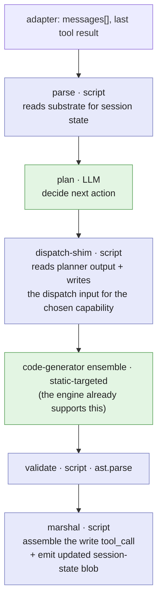
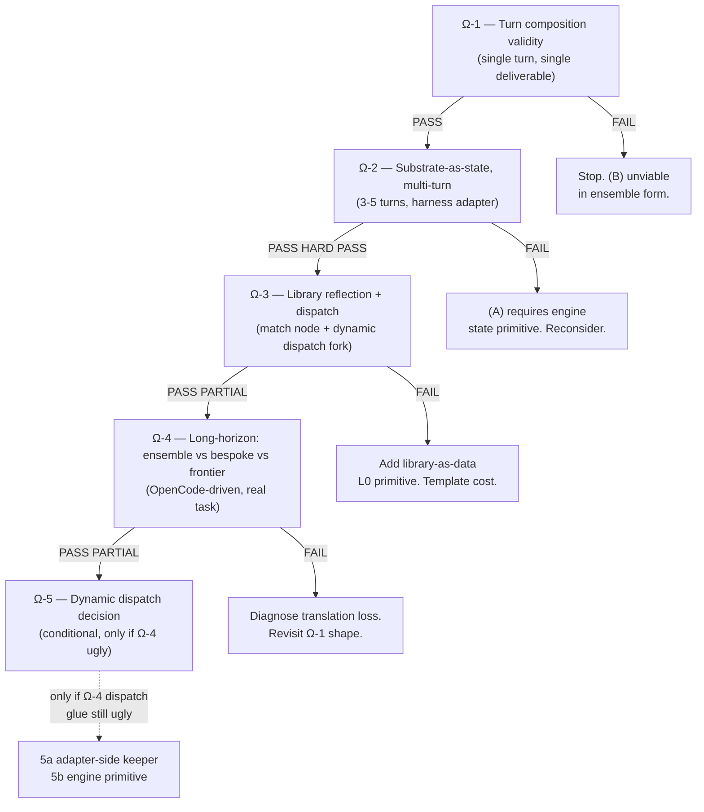

# Design exploration: spike sequence for ensemble-driven agentic flow

**Status:** in-progress. Ω-1 GATE PASSED 2026-06-29 (single-turn composition
validity). Ω-2 SPLIT VERDICT 2026-06-29 (re-scored against the 9-run log):
PASS on substrate-I/O threading (cross-run state collapses to parse/marshal
scripts, no engine primitive); OPEN on multi-turn task completion (0 of 9
logged runs finished the 3-file task; the form minus a recovery loop does
not converge). The next spike is Ω-2b (runtime control: recovery + dynamic
dispatch, adapter-side), which subsumes Ω-3's dispatch half. Ω-3+
renumbering deferred.
Pairs with `deterministic-first-ensemble-agent.md` (the §6 engine verdict
+ the strategic fork) and `agent-as-ensemble-composition.md` (the §4 flow
+ the contractual surface). This one decomposes "is (B) viable" into a
sequence of small, gated spikes and sharpens the substrate-+-scripts
reframe that makes three of the four §6 primitives potentially disappear.

**Settled outcome (2026-06-29):** the spikes resolved this — see
`ensemble-serving-architecture.md` for the as-built serving architecture
(diagrammed) and the composition-strategy menu. Headline: the ensemble-only
form serves OpenCode transparently and drives a multi-file task to completion
(question (a): yes); cheap-composition quality is the open problem (question
(b)). The frontier-beats-comparison framing was retired (frontier is the
assumed-capable baseline, not the thing to beat).

**Built 2026-06-29** from reading the §6 verdict (`core/execution/ensemble_runner.py:66`, `dependency_analyzer.py:80`, `ensemble_execution.py:729`), the existing script-agent execution path (`agents/script_agent.py:555`), the existing capability library (`.llm-orc/ensembles/agentic-serving/`), and **running Ω-1 and Ω-2 to first real data** — see §12 for consolidated findings.

---

## 1. The two parent questions

The branch's nine loop-backs routed around the core engine by accumulating bespoke Python above it. The fresh-path question is whether the engine itself, plus its existing composition primitives (ensembles-of-ensembles, script stages, nested DAGs), can host agentic flow. Two questions, in sequence, because the second depends on the first:

- **(A) Composability.** Can the engine + composition express an agentic turn at all, with reasonable bespoke glue for what the engine structurally lacks?
- **(B) Long-horizon viability.** Given (A), can llm-orc be used reliably with OpenCode to drive real, long-horizon agentic flows by delegating to ensembles?

(B) is the §5 "MAY BEAT" row and the architecture-map's axis-2 PLAY target. (A) gates whether (B) is even worth running. The branch already proved (B)'s *mechanism* works in Python; what it didn't prove is whether the engine's composition form preserves that mechanism's value. The spike sequence targets (A) first, then (B).

---

## 2. The reframe: scripts + artifact substrate collapse most §6 primitives

The §6 verdict lists four missing primitives. Three of them go away if script stages use the artifact substrate as the universal coupling layer. **This is the leverage the prior path missed by routing bespoke logic into Python above the engine instead of into script stages inside it.**

The execution path (`script_agent.py:555`, plus all the `_execute_*` variants) runs `subprocess.run` with `env=os.environ.copy()`. There is no `cwd` restriction, no filesystem sandboxing, no allowed-paths list. A Python script stage has **full read/write filesystem access today**. The §6 note "env + stdin only" describes the engine's *input channel* to scripts, not a sandbox. So:

| §6 missing primitive | What the engine does today | Collapse via scripts + substrate? |
|---|---|---|
| **Library-as-data to a stage** | `EnsembleLoader.list_ensembles()` returns Python objects unreachable from a script subprocess | **Yes**, fully. A script reads `.llm-orc/ensembles/**/*.yaml` directly. No L0 work. |
| **Cross-run / parent→child state threading** | Within-run: `depends_on` + shared `results_dict`. Cross-run: nothing. | **Yes**, fully. The adapter serializes session state (produced-set, plan-queue, remaining-work anchor) to a substrate path between turns. A parse-script in the next turn reads it; a marshal-script writes the updated blob. The "context-tracker" of §4 becomes two ordinary script stages. |
| **Conditional branching** | Every phase runs unconditionally (`ensemble_execution.py:729`). Dependency gate only checks *that* a dep ran, never *what it produced*. | **Yes**, with a caveat. A downstream script reads an upstream stage's output and no-ops when the gate says skip. Will-run-as-no-op is the cost; the behavior is expressible. The clean-branch primitive is the §8 alternative if no-op scripts proliferate. |
| **Script-initiated dynamic dispatch** | `ensemble_runner.py:66` resolves the child target from a static `agent_config.ensemble` YAML string. A script cannot trigger a runtime-chosen nested ensemble. | **No**. This is the one primitive scripts cannot emulate. A script can write "the next ensemble to call is X" to a substrate file, but only the adapter or the engine can actually invoke X. |

Three of four collapse. The remaining primitive, dynamic dispatch, is the §7 fork: the one that changes the engine's character "from declarative dataflow toward an interpreter." The spike sequence is designed to defer it as long as possible, and possibly eliminate it.

---

## 3. Spike Ω-1 — Turn composition validity

**Status: ✅ GATE PASSED 2026-06-29.** See `scratch/spike-omega-1/README.md`
for run artifacts + glue inventory, §12 here for consolidated findings.

**Question:** Can one agentic turn (the §4 shape) be expressed end-to-end as an ensemble under the existing engine, with bespoke glue only for what the engine structurally cannot do?

**Shape (cheapest version):** One concrete behavior. A single-turn produce-one-deliverable flow that the bespoke `LoopDriver` already handles, re-expressed as ensemble YAML + script stages. No multi-turn threading, no `complete?` branch (skip it on first turn), no plan-queue. Minimize the surface.

Static-targeted because for one task shape (single file), the capability `code-generator` is fixed. `ensemble_runner.py:66`'s static-target limitation does not bite when the target is known at YAML time. The `dispatch-shim` replaces the bespoke `_delegate_generation` path; it is a script stage that writes a structured dispatch input which the static ensemble reference receives.

**Bespoke glue inventory is the output, not a side effect.** After a PASS run, list every shim the spike used. That ranked list is the artifact that informs Ω-2 and Ω-3, and the artifact that tells us whether the bespoke `LoopDriver` cruft was *mechanism* (transferable to scripts) or *engine-limitation* (transferable only with new primitives).

**Gate:**
- **PASS:** the ensemble produces a coherent `write` tool call end-to-end, delegation to `code-generator` fires, `ast.parse` passes, OpenCode executes the write and lands a runnable file. Proceed to Ω-2 with the glue inventory.
- **FAIL:** the ensemble form cannot host even a single turn. Stop; abandon (B); return to the bespoke.

**Learns early:** whether the existing engine, with no new primitives, expresses the irreducible ensemble-turn. Expected outcome: PASS. The engine supports LLM stages, nested ensembles with dynamic input, and script stages. The first thing the bespoke `LoopDriver` needed that the engine couldn't provide was dynamic dispatch, and for one fixed-target turn we sidestep it.

---

## 4. Spike Ω-2 — Substrate-as-state, multi-turn

**Status: ⚠️ SPLIT VERDICT 2026-06-29 (re-scored against the 9-run log).**
PASS on the substrate mechanism: cross-run state threads via parse/marshal
scripts with no engine primitive. OPEN on the actual gate (multi-turn task
completion): across 9 logged runs, 0 finished the 3-file task and 0 produced
2+ distinct valid files; the queue advanced across turns in only 1 of the 3
runs where any file landed. The substrate I/O works; the ensemble form minus
bespoke's recovery loop (ADR-041) does not converge. See
`scratch/spike-omega-2/README.md` for run artifacts + glue inventory, §12
here for consolidated findings.

**Question:** Does cross-turn state threading need an engine primitive, or do parse/marshal scripts using the artifact substrate suffice?

This is the spike the §2 reframe predicts a PASS on. The hypothesis is that the adapter holds session state across turns, hands the ensemble an input that includes a path to the prior-turn state blob, and the ensemble's parse-script reads it while the marshal-script writes the updated blob. The engine's existing dataflow contract (input on stdin/env, output on stdout/JSON) is unchanged.

**Shape:** 3–5 turns. No OpenCode for now; a harness acts as the adapter between turns. Task: 2–3 file multi-file composition (the exact shape the bespoke `LoopDriver` already handles per ADR-038, the remaining-work anchor). Each turn:
1. The harness writes `session_state.json` to a substrate path with `{produced: [converters.py], requested: [converters.py, cli.py, README.md], remaining_anchor: "...", plan_queue: [...]}`.
2. The Ω-1 ensemble is invoked with input `{task, last_tool_result, substrate_path}`.
3. The parse-script reads `session_state.json` → threads into plan-stage input.
4. The plan-stage LLM decides the next action (e.g. "write converters.py next").
5. The marshal-script writes the updated `session_state.json` (produced grows, anchor advances) AND emits the `write` tool call.
6. The harness reads the tool call, simulates the client write, advances to the next turn.

Compare against the bespoke `LoopDriver` on the same task shape. The bespoke uses `SessionActionRecord` + `_completeness` + `remaining_anchor` as in-process state; the ensemble-form uses a substrate file. Both should produce identical trajectories if the substrate-+-scripts reframe holds.

**Gate:**
- **HARD PASS:** ensemble-form multi-turn holds with no engine primitive added, AND its trajectory matches bespoke on the same task (same delegation decisions, same convergence, no file churn). Drop §6 primitive 3 (cross-run state) from the work list. Proceed to Ω-3.
- **PASS:** ensemble-form multi-turn holds but trajectories diverge from bespoke. Diagnose the divergence before continuing; it may indicate something the bespoke cruft was doing that scripts cannot easily replicate.
- **FAIL:** cross-turn state needs real engine state-machine work. The §6 count stays at four; reconsider whether the bespoke's `SessionActionRecord` is actually an irreducible primitive.

**Learns early:** whether the long-horizon bet depends on engine work, or is a *framing* question (how the ensemble expresses its inputs and outputs, not how the engine handles state). Predicted PASS or HARD PASS.

---

## 4b. Spike Ω-2b — Runtime control: recovery + dynamic dispatch (adapter-side first)

**Status: all three pieces RAN 2026-06-29.** (1) Recovery PASS as a mechanism
(form failures recover adapter-side, no engine primitive — the thing Ω-2
could not do), but task-correctness OPEN: the `ast.parse`-only gate
over-reports (cli.py passed while off-spec; README.md passed as Python-in-a-
`.md`), so real correctness was ~1-1.5 of 3; latency 6.75-15.6 min for the
3-file toy, high retry variance incl. a 413s qwen3 blowup. (2) Dynamic
dispatch PASS: correct runtime routing (.py→code-gen, .md→prose-gen),
adapter-mediated, dispatcher ~3-15 lines → strong 5a (defer the 5b engine
primitive indefinitely); caveat — siblings reach the planner, not the
producer, so the README invented an API name (grounding weaker than ADR-039).
(3) OpenCode smoke PASS on the wire contract over real HTTP curl (clean
`tool_calls` / `finish_reason`); real-OpenCode multi-turn drive deferred to a
`! opencode run` step. Full findings: `scratch/spike-omega-2b/README.md`,
`scratch/spike-omega-dispatch/README.md`, `scratch/spike-omega-smoke/README.md`.

Reordered ahead of Ω-3 (library reflection) because Ω-2 showed the block on
multi-turn completion is not the substrate mechanism, it is the missing
recovery loop — and recovery and dynamic dispatch are the same architectural
question: can the between-turn adapter mediate runtime control, or does the
engine need an L0 primitive?

**Question.** With an adapter-side retry on validate failure (recovery) and an
adapter-side resolution of a runtime-chosen capability (dynamic dispatch), does
the ensemble form complete the 3-file task it could not complete in Ω-2? And
does keeping both behaviors in the adapter stay clean (the §8 boundary), or
does it bloat past the point where an engine primitive is warranted?

**Why both at once.** Ω-2's Finding #4 (recovery) and the deferred
dynamic-dispatch fork are one question wearing two hats. Both ask whether the
between-turn adapter can hold control flow the engine's static DAG cannot.
Spiking them together tests the §8 "irreducible serving glue" boundary on the
two demands that decide (A)-vs-(B), instead of validating the easy
substrate-I/O win a third time.

**Shape.** Extend the Ω-2 harness (the adapter skeleton) with three behaviors,
no engine change:

1. **Recovery (adapter-side retry).** On a validate failure, the adapter
   re-invokes the ensemble for the *same* file with a "production-rejected:
   re-emit ONLY this file, fix `<the ast error>`" input, up to N retries
   (start N=2) before it gives up on that file. This is bespoke's ADR-041
   self-healing re-dispatch relocated from in-process to between-turn.
   Measure: does the 3-file task now converge, and at what retry count.

2. **Dynamic dispatch (adapter-side resolution).** Add a second capability (a
   prose ensemble for `README.md`) and a `score` script that reads the library
   and picks the capability per file. The chosen ensemble name is written to
   the substrate; the adapter resolves it and invokes the chosen ensemble
   between turns (the §8 boundary, not the engine's static `ensemble:` field).
   Measure: lines of adapter dispatcher code. A ~30-line resolver means (5a)
   holds and Ω-5's engine primitive defers indefinitely; growth past ~100
   lines or a pull toward composability is the Ω-5 (5b) signal.

3. **Real-OpenCode smoke (the contract check).** Stand up a thin
   chat-completions adapter around the Ω-1 ensemble and have a real OpenCode
   client drive ONE turn end-to-end (request → `tool_call` → client write).
   This validates the marshal's `tool_call` / `finish_reason` shape against the
   real client, not the hand-shaped harness — the WP-A failure mode the corpus
   already paid for once. One turn is enough; multi-turn behavior is covered by
   1+2 in the harness.

**Gate:**
- **PASS:** recovery makes the 3-file task converge (3 distinct valid files
  across the session), adapter-side dispatch stays small (~30 lines), and
  OpenCode drives the Ω-1 turn cleanly. Ω-3 (library reflection at scale) and
  Ω-4 (long-horizon vs frontier) proceed on a form that finishes.
- **PARTIAL:** recovery converges but the dispatcher bloats, OR the OpenCode
  contract needs marshal changes. Proceed to Ω-3 with the dispatch decision
  flagged for Ω-5 and the contract delta recorded.
- **FAIL:** recovery does not converge even with retries (per-file failure rate
  too high for retry to rescue), OR the OpenCode contract is fundamentally
  mismatched. Then the ensemble form's reliability gap is real and the
  (A)-vs-(B) read tilts toward (A): the bespoke's in-process recovery is doing
  work the adapter cannot cheaply replicate.

**Learns early:** whether the ensemble form, with the cheapest honest version
of recovery, actually completes a multi-file task — the thing Ω-2 did not show
— and whether the two runtime-control demands fit the adapter boundary the §8
framework already concedes. This is the precondition for Ω-4 producing a
meaningful (B) data point.

---

## 5. Spike Ω-3 — Library reflection: scripts read the ensemble library

**Reordering note (2026-06-29):** Ω-2b (§4b) now runs first and pulls in the
dynamic-dispatch half of this spike (the `score` script + adapter dispatch).
What remains here is library reflection *at scale* (scoring across a larger
capability set), run after Ω-2b on a form that converges.

**Question:** Can a script stage do the §3 `match` node (capability-scorer) by reading the YAML library directly from the filesystem, with no engine primitive added?

The §6 verdict named library-as-data as the primitive with strong determinism potential (embeddings + rules + LLM tiebreak). The §2 reframe predicts scripts can do this without engine help, since scripts have filesystem access.

**Shape:** Replace Ω-1's `dispatch-shim` (which statically targeted `code-generator`) with a reflection-+-scoring pair of script stages:

- **reflect script:** reads `.llm-orc/ensembles/agentic-serving/*.yaml`, parses each, emits a structured list of capabilities (`name`, `description`, `topaz_skill`, `output_substrate`).
- **score script:** given the planner's next-action description and the capability list, scores them by embedding similarity or rule-based keyword match. Emits the chosen capability name. If the top score is below a confidence threshold (or two are close), emit a tiebreak request that an LLM stage resolves.
- **dispatch shim (extended):** reads the chosen capability name from the score script's output. If the engine's static-target limitation blocks dispatch, route via the adapter (the script writes the chosen name to the substrate; the adapter's between-turn step invokes the chosen ensemble directly, returning the result in the next turn's input).

This last branch is the §6 primitive-4 fork surfacing in disguise: if the chosen capability can only be invoked by the adapter between turns, the ensemble's `match` node is real but the `dispatch` node is a delegation-to-adapter rather than a delegation-to-engine. That is the §8 boundary model (the irreducible serving glue).

**Gate:**
- **PASS:** reflection and scoring work entirely in scripts; the ensemble emits a chosen capability; the adapter or the engine executes it. Some bespoke glue is needed for the actual invocation, but it is small (a between-ensemble call in the adapter). Proceed to Ω-4.
- **PARTIAL:** reflection works but the adapter-mediated dispatch becomes load-bearing ugliness (e.g. requires extending the adapter with a per-turn dispatcher API). Proceed to Ω-4, but flag the dynamic-dispatch decision for Ω-5 with this evidence.
- **FAIL:** the ensemble library read or the scoring is impractical from a script subprocess (e.g. the loader validates and caches in ways the script cannot replicate). The Ω-2 primitive (library-as-data) becomes a real engine primitive to add. Templates the cost of one L0 extension before continuing.

**Learns early:** whether three of the four §6 primitives collapse, leaving only the dynamic-dispatch decision. Predicted PASS on reflection; predicted PARTIAL on dispatch (the engine's static-target limitation will force either adapter-mediated dispatch or a real dynamic-dispatch primitive).

---

## 6. Spike Ω-4 — Long-horizon: ensemble-form vs. bespoke vs. frontier

**Question:** The §5 "MAY BEAT" row. Does ensemble-form deterministic-externalization beat single-context frontier on long-horizon, with OpenCode driving?

This is the spike that produces the (B) data point. The branch's bespoke `LoopDriver` was an accidental pilot for this question; Ω-4 re-runs it in ensemble form and adds the missing comparison arms.

**Shape:** Drive a long-horizon multi-file task against OpenCode. Three arms:
- **Ensemble-form** on cheap-local (qwen3:8b coder, qwen3:14b seat): the Ω-1+Ω-3 ensemble, multi-turn via the Ω-2 adapter.
- **Bespoke LoopDriver** on the same config: the existing as-built baseline, for trajectory comparison.
- **Frontier single-context** (Zen or similar frontier arm) on the same prompt: no delegation, no substrate, single-shot completion within one large context.

Task shape: 5–8 deliverables, mixed dependencies (some files reference others). The exact shape the bespoke branch's ladder eventually reached (loops-back #6 through #9).

**Gate:**
- **PASS:** ensemble-form matches bespoke on trajectory (no regression from the Python→ensemble translation) AND beats or holds frontier on at least the grounding + verification rows. The §5 "central bet" (long-horizon coherence) gets a real data point. Proceed to Ω-5 if the dispatch glue is still ugly; else declare (B)PROJECT WIN and write the unification proposal.
- **PARTIAL:** ensemble-form matches bespoke but does not beat frontier. (A) is validated; (B) reads "competitive but not superior," attributed to composition rather than substrate. Still useful; the branch's north-star gains a second viable form.
- **FAIL:** ensemble-form degrades vs. bespoke. The translation lost something bespoke had; likely the cruft accumulated through nine loop-backs was doing real work. Diagnose; revisit Ω-1's shape.

**Learns early:** whether the ensemble form preserves the bespoke's hard-won patterns, and whether those patterns (in either form) actually beat single-context frontier on long horizons. This is the spike the entire branch trajectory was unconsciously preparing for, run in its right substrate.

---

## 7. Spike Ω-5 — Dynamic dispatch (deferred, conditional)

**Only if Ω-4 passes** and the Ω-3 dispatch glue inventory identifies dynamic dispatch as still ugly in the surviving system. This is the §6 primitive 4 fork, the §7 "changes the engine's character" concern.

**Decision at this fork:** should dynamic dispatch be:
- **(5a) kept adapter-side** (a small dispatcher script in the thin HTTP adapter invokes the chosen ensemble between turns). The engine stays a dataflow DAG; the dispatcher logic lives outside it; the agent remains a system of (ensemble + adapter).
- **(5b) added as an engine primitive** (a script stage can request a runtime-chosen nested ensemble). The engine becomes an interpreter; every non-agentic ensemble user is affected. Cost is calibration from Ω-2.

The §8 framework already accepts a thin adapter as the irreducible serving glue. (5a) keeps the adapter honest; (5b) expands the adapter (and arguably the engine). If (5a) costs a 30-line dispatcher script, defer (5b) indefinitely. If the dispatcher grows past 100 lines or feels like it should be composable, escalate to (5b) with Ω-2's calibration in hand.

**Learns early:** whether (B)'s one missing primitive is actually missing, or whether it collapses the same way the other three did, via the adapter boundary the §8 framework already concedes.

---

## 8. Spike sequence + gates

Each gate is a real stop, not a "adjust and continue." If Ω-2 fails, the §6 primitive count stays at four and the bespoke path may be the honest answer. If Ω-4 fails, the ensemble form lost value in translation, and that value needs to be named before proceeding.

---

## 9. Three things this sequence is designed to surface

1. **The §6 four primitives may be three, two, or one.** Ω-2 predicted PASS drops primitive 3 (cross-run state). Ω-3 explores whether primitives 1 (library-as-data) and 2 (conditional branching) collapse too, leaving only primitive 4 (dynamic dispatch). The §7 fork is about whether primitive 4 is the real engine-character change, or whether the adapter (§8) absorbs it.

2. **The bespoke `LoopDriver` cruft is a reference implementation, not throwaway.** If Ω-1 PASSes, the L2 modules translate rather than get rewritten: `SessionActionRecord` → parse/marshal scripts; `_completeness` → term-script stage; `sibling_interface_extractor` → anchor script stage; `FormGate` parse-check → validate script stage; the `remaining_anchor` → a substrate path the marshal script updates. Nine loop-backs of battle-scarring become nine reference implementations. The unification work is translation, not invention.

3. **The block on (B) is not engine work, it is latency.** The architecture-map's `§2 boundary` names this; ADR-043 retired the LLM-driven dispatch pipeline for being slow. Ensemble-form has more per-turn round-trips than bespoke Python. Ω-1 measures this directly. If ensemble-form per-turn latency is much worse than bespoke, (B) trips on a non-architectural constraint and the L0 work is moot. **The latency measurement from Ω-1 is the first thing the spike sequence produces that no design doc can**, and it should inform whether to proceed to Ω-2 at all.

---

## 10. What's deferred, and what stays bespoke either way

Three things this sequence does not tackle, by design, because they are settled or posterior:

- **The HTTP adapter.** §8 already concedes a thin serving adapter as irreducible. The ensemble engine runs a DAG to completion; it cannot pause mid-DAG for a client tool. Between-turn interleaving and session continuity live in the adapter. Ω-2's harness *is* this adapter in skeleton form. Whether it stays 30 lines or grows depends on the Ω-3 dispatch decision.
- **The planner and the producer LLM stages.** These are not engine questions; they are model-profile and prompt-engineering questions that compose identically whether the surrounding flow is bespoke Python or ensemble YAML. The branch's ADR-036 (delegation mechanism) and ADR-039 (content anchor) carry over verbatim. Spikes reuse the existing `code-generator` capability ensemble, not a new one.
- **Calibration, budget, and tier-escalation.** These are L1 concerns the architecture-map places correctly. They compose with either substrate. Ω-4 may surface a config gap between bespoke and ensemble-form (e.g. the AS-3 cap wiring), but those are wiring details, not architectural blockers.

---

## 11. The honest framing against the doc trail

The deterministic-first doc ends with §7's "resume here, fresh session" and asks the practitioner to choose A or B. This sequence is the answer to that question: **don't choose, measure.** The branch's nine loop-backs have already produced the bespoke `LoopDriver` as an implicit proof-of-concept for (B) in Python form. The fresh path is not "decide whether to generalize the engine"; it is "find out whether the engine + composition preserves the bespoke's value, in four gated steps, each stopping at a real go/stop."

If Ω-2 hard-passes, the §6 primitive count drops by one and the long-horizon bet decouples from L0 engine work. If Ω-3 passes, it drops by two more. If Ω-4 passes, (B) is validated. Ω-5 only matters if the surviving bespoke glue is still ugly, and by then the answer will be informed by what the surviving-glue inventory actually contains, not by speculating about it from §6.

The deterministic-first framing was right that shrinking the stochastic surface is the strategy. The substrate-+-scripts reframe sharpened here is the mechanism by which it shrinks further than §6 predicted: three of four primitives collapse by composition alone, and the remaining one may collapse by adapter boundary.

---

## 12. Findings from Ω-1 and Ω-2 (first real data)

Ω-1 ran 2026-06-29: the single-turn, single-deliverable ensemble under the
existing engine, with the §4 shape. PASS. Latency **87s** for one Python
file. Ω-2 ran 2026-06-29: multi-turn substrate-threaded ensemble against
a 3-file task, 9 logged runs. **Split verdict.** The substrate mechanism
PASSES (parse reads, marshal writes, no engine primitive). Task completion
is OPEN: 0 of 9 runs finished the 3-file task, 0 produced 2+ distinct valid
files. Best case was 1 valid file (`converters.py`) in 3 runs; in 2 of those
the queue failed to advance (turn 2 re-attempted `converters.py`), and one
early run wrote `cli.py` twice and never `converters.py`. The persisted
`session_state.json` shows `produced: []` (the last run landed nothing). The
gap is bespoke's recovery loop (ADR-041): without re-dispatch on validate
failure, the modal outcome is 0 files. Latency **70-80s/turn** with the lean
single-coder `code-generator-omega` fork; **200-220s/turn** with the
production 3-stage `code-generator` (coder → critic → synthesizer); high
variance (up to ~232s on a lean-era retry).

These findings now change the shape of the remaining sequence. The
artifacts: `scratch/spike-omega-1/README.md` + `scratch/spike-omega-2/README.md`.

### Substrate-+-scripts primitive 3 (cross-run state) — collapses cleanly

The §2 bet HOLDS. parse reads `session_state.json` from the substrate
path threaded through the input; marshal writes the updated state back.
Cross-turn state is parse-script + marshal-script + filesystem — not an
engine state-machine primitive. Working code; no L0 change.

### Plan-stage determinism — applied ruthless structure

The plan LLM ignored `plan_queue[0]` ordering and re-chose files on
early runs. Bespoke's deterministic completeness gate (ADR-040) picks
the file FROM the queue head; the LLM elaborates only the brief.
The ensemble form had to inherit the same structure: parse emits
`next_file` explicitly, `dispatch_shim` uses parse's `next_file`
overriding the plan LLM's choice (one extra dep edge:
`dispatch-shim depends_on [parse, plan]`). Cruft transferred cleanly;
matches bespoke's deterministic-first principle.

### Form directive cruft (D2b) recurs — recovery loop not yet in ensemble form

The code-generator coder's output occasionally leads with shell usage
examples (`python cli.py convert c-to-f <value>`), filenames on the
first line, mixed indentation, prose-wrapped code. `validate.py` got
two hardening layers (filename-strip, shell-prefix-strip, fenced-block
extraction, fallback to first `def`/`import`). It catches genuinely bad
output but does not auto-recover — bespoke's ADR-041 re-dispatch recovery
is a third cruft layer that hasn't translated yet. The harness just stops
on validate failure.

**Implication for the gate:** ensemble-form multi-turn holds for
*valid* outputs. The bespoke cruft comes back as adapter-side retry
logic. Stays open for Ω-3+.

### Fresh Ω-2 engine finding: the script cache breaks substrate flow

Not in the §6 doc. The `ScriptCache` (`core/execution/scripting/cache.py:65`)
keys on `script_content + input_data + parameters`. The harness sends
**byte-identical input across turns** (`{task, substrate_path,
last_tool_result}` unchanged), but the substrate file content changes
between turns. Turn 2's parse returned turn 1's cached output and
dispatch-shim picked the wrong file.

Workaround landed in `.llm-orc/config.yaml`: `performance.script_cache.enabled: false`.
Real fixes the engine could provide:
- cache key includes a substrate-file hash (small L0 extension), OR
- per-ensemble / per-stage YAML flag `script_cache: false` (cheap, no
  L0 work, surfaces the opt-out at config time).

This is a new candidate for the engine-extension list beyond the §6
four. **It's small surface, high payoff** — any composition pattern that
relies on substrate-driven behavior across runs hits it.

### Ω-1 engine finding re-stated: `_find_ensemble_in_dirs` asymmetric

The engine's `_resolve_ensemble_reference` (`ensemble_execution.py:886`)
calls `_find_ensemble_in_dirs` (`ensemble_config.py:677`), which is
non-recursive. Production's `OrchestraService.find_ensemble_by_name`
calls `EnsembleLoader.find_ensemble`, which IS recursive. The
agentic-serving library lives one level deep under `agentic-serving/`,
so `ensemble: <nested-name>` returns "ensemble not found" inside the
engine. The bespoke never hit this because it dispatches via
`OrchestraService.invoke`, not via static-target YAML.

Workaround: two symlinks (`.llm-orc/ensembles/code-generator.yaml` →
`agentic-serving/code-generator.yaml`, and
`.llm-orc/ensembles/code-generator-omega.yaml` →
`spike-omega/code-generator-omega.yaml`). Proper fix for Ω-3+:
the engine's resolver should walk recursively, OR the adapter should
resolve nested ensemble config and pass it directly. Cheaper than any
§6 primitive.

### Latency is the boundary

- Ω-1 single-turn, single-deliverable: **87s**.
- Ω-2 per-turn with 3-stage code-generator chain: **200-220s**.
- Ω-2 per-turn with lean 1-coder `code-generator-omega` fork: **70-80s**.
- Bespoke's typical per-turn: **5-30s** per the architecture-map and
  the cycle-7 PLAY field notes.

Composition tax is ~3-6× bespoke. The 3-stage production code-generator
chain (~220s/turn) is non-viable for long-horizon flows; the lean
single-coder (~70-80s/turn) is workable but still far from bespoke.
**The architectural bet that composition offsets frontier-big-context
for cost only lives if latency is comparable, or if decomposition
savings offset the chain.** Ω-4 needs to test this head-on.

### Clean fall-through: what's certain now

- The ensemble form composes one agentic turn under the existing
  engine — no L0 work required. (Ω-1 PASS.)
- Cross-turn substrate state in the ensemble form is parse+marshal
  scripts + filesystem — no engine primitive needed. (Ω-2 PASS.)
- Three of the four §6 primitives collapse under the substrate-+-
  scripts reframe, as predicted in §2 (the script-cache finding is a
  fresh fifth concern, smaller than the §6 four).
- The plan-stage's freedom must be structured out: the LLM only
  elaborates brevity; deterministic-from-substrate value selection
  belongs in scripts.

### Still open for Ω-3 (the dynamic-dispatch test)

- Library reflection: parse stage reads `.llm-orc/ensembles/`
  recursively and produces a capabilities list (no engine primitive
  expected — §2 reframe predicts this just like primitive 3).
- Dynamic dispatch: when the chosen capability varies per turn, can
  a static-target YAML still express it (via adapter mediation, the
  §8 boundary), or does it require Ω-5's L0 primitive?
- The engine's asymmetric ensemble-name resolver (Ω-1 finding) must
  be properly handled before Ω-3 runs.
- The script-cache finding must be properly handled: per-ensemble
  opt-out OR fix the cache key.

### Still open past Ω-3

- Recovery loop (Ω-2 Finding #4): adapter-side retry on validate
  failure.
- Latency: whether ensemble-form equals bespoke at Ω-4 long-horizon
  running with the lean fork; whether the production code-generator
  3-stage chain can be parallelized or short-circuited.
- Cross-file coherence ground truth (Ω-2 was 1-of-3 files landed —
  not enough sibling-content substrate threading observed).